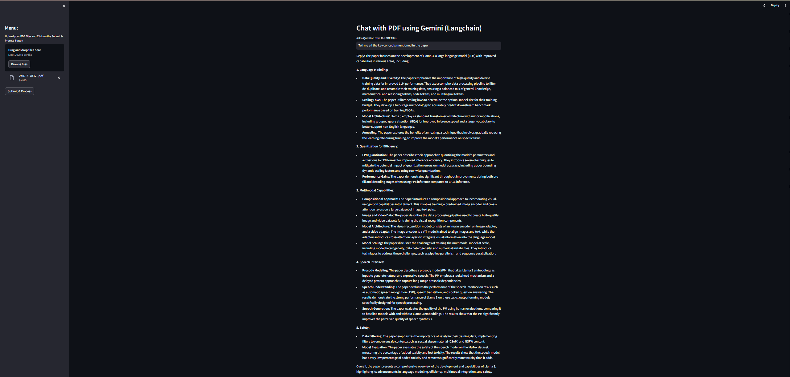

# Research Paper Analyzer

**Research Paper Analyzer** is a tool designed to extract and analyze key concepts from research papers in PDF format using two different processing pipelines. The tool leverages state-of-the-art AI models to provide insightful responses based on the content of the research papers.

## Features

- Extracts text from PDF documents.
- Analyzes key concepts using two distinct pipelines.
- Provides different approaches to understanding and summarizing research papers.
- Streamlit-based interface for ease of use.

## Installation

1. **Clone the repository**:
    ```bash
    git clone https://github.com/Aopandey/Research-Paper-Analyzer.git
    cd Research-Paper-Analyzer
    ```

2. **Install dependencies**:
    ```bash
    pip install -r requirements.txt
    ```

## Usage

To run the Streamlit app, use one of the following commands depending on the pipeline you want to use:

```bash
streamlit run src/pipeline_1.py  # For Pipeline 1 (LangChain-based)
streamlit run src/pipeline_2.py  # For Pipeline 2 (ChromaDB-based)
```

## Example Query
**Query :** "Tell me all the key concepts mentioned in the paper."

### Pipeline Differences
This project includes two distinct pipelines for analyzing research papers:

#### Pipeline 1 (LangChain-based with FAISS)-

**Approach:** This pipeline uses FAISS for vector search combined with Google Generative AI for querying.

**Output:** The results from this pipeline are more detailed and expansive, providing an in-depth summary of the key concepts extracted from the entire document.


#### Pipeline 2 (ChromaDB-based)-

**Approach:** This pipeline leverages ChromaDB to search and retrieve relevant chunks of text based on the query, which are then processed by Google Generative AI.

**Output:** The results from this pipeline are more concise, focusing on the core aspects of the research paper, specifically on technical details like model architecture and specific AI techniques.


### Observations:

**Pipeline 1** provides a broader context and more comprehensive insights, which is useful when looking for a general understanding or when the paper covers diverse topics, as seen in the detailed summary of Llama 3.

**Pipeline 2** offers more targeted results, which can be beneficial when the focus is on specific technical details or when querying very specific concepts, such as the focus on the Transformer model and its components.

### Example

Below are screenshots showing the outputs of both pipelines for the query "Tell me all the key concepts mentioned in the paper":

**Pipeline 1 (LangChain-based):**


**Pipeline 2 (ChromaDB-based):**

